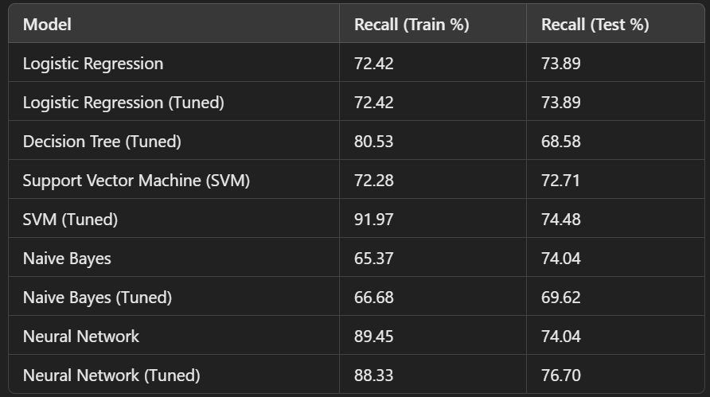

# Cardiovascular-Disease-Risk-Prediction Using Machine Learning
In this project, we’ll create a robust predictive model to assess the risk of cardiovascular disease (CVD) using the random forest algorithm.

Our approach involves a well-structured pipeline utilizing seaborn and Matplotlib for data exploration and the Scikit-learn (sklearn) library for data preprocessing. We'll curate a relevant dataset containing key features like age, gender, blood pressure, and cholesterol levels associated with cardiovascular diseases (CVDs). Visualizing the data attributes and examining relationships between variables and the CVD risk using seaborn and Matplotlib will be crucial. Then, leveraging Scikit-learn, we'll handle missing values, encode categorical variables, and normalize or scale numerical attributes to prepare the dataset for model training.

Our goal is to develop a robust CVD risk prediction model using the random forest algorithm. Insights gained from data exploration and Scikit-learn's capailities will enhance risk assessments, potentially aiding healthcare professionals in making informed decisions regarding patient care and disease prevention.\
We will focus on leveraging machine learning to predict the 10-year risk of coronary heart disease (CHD) in patients, utilizing data from the renowned Framingham Heart Study conducted in Framingham, Massachusetts. The dataset encompassed information on over 4,000 participants, with 15 attributes representing potential risk factors for CHD, including demographic, behavioral, and medical characteristics.

**Data Preparation and Preprocessing**

****Data Cleaning and Transformation**
* Handling Missing Values: Missing values were addressed using techniques such as median, mode, and K-Nearest Neighbors (KNN) imputation to preserve data integrity. 
* Outlier Detection: The Interquartile Range (IQR) method was employed to identify and remove outliers.
* Skewness Adjustment: Continuous variables with skewed distributions were transformed using logarithmic and square root transformations, enhancing model performance.

** Feature Engineering**
* Multicollinearity Elimination: Variance Inflation Factor (VIF) analysis was used to detect and remove multicollinear features.
* New Feature Creation: A derived feature, pulse pressure (difference between systolic and diastolic blood pressure), was added to capture blood pressure dynamics.
* Feature Selection: Redundant columns were removed, and the most impactful predictors of CHD risk were identified, including:
  * Demographic: Age, sex, education
  * Behavioral: Cigarettes per day (cigs_per_day)
  * Medical: BP medications, prevalent stroke, prevalent hypertension, diabetes, total cholesterol, BMI, heart rate, glucose, pulse pressure

**Addreing Data Imbalance and Scaling**
    * **Class Balancing**: The dataset exhibited an imbalance in CHD risk classes. The SMOTE (Synthetic Minority Oversampling Technique) combined with Tomek Links undersampling was utilized to balance the class distribution.
    * **Feature Scaling**: Standard scaling ensured that all features operated on the same numerical scale, optimizing model performance.

**Machine Learning Models and Performance**
Several machine learning models were trained and evaluated, with recall selected as the primary evaluation metric to prioritize correctly identifying patients at risk of CHD. The models and their performance metrics are as follows:

**Final Model Selection**
The Tuned Neural Network was chosen as the final model due to its superior recall score of 76.70% on the test set. This ensured a higher rate of identifying patients at risk of CHD, even at the cost of some false positives.
